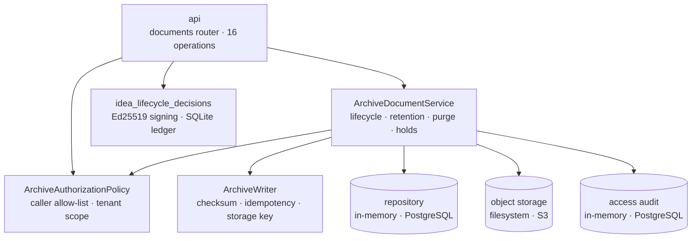

# Architecture

How `lotus-archive` is put together, and which parts are real. Measured against `main`.

## Shape

A single FastAPI application with one document router, a small middleware stack, and a service layer
composed at startup from settings.

The three cylinders are the persistence boundary. Local profiles use the development adapters;
production composes PostgreSQL metadata/audit and S3-compatible object storage — see
[Configuration](Configuration#what-can-actually-run).

## Module families

The repository is organised around seven families, and the boundaries are meant to hold as it grows:

| family | responsibility | source of truth |
|---|---|---|
| `metadata` | document identity, source-backed metadata, support-safe lookup | archive metadata model, with upstream references from Report and Render |
| `storage` | object storage abstraction, checksum verification, binary retrieval | storage adapter and checksum evidence |
| `audit` | access and lifecycle audit records | access-audit model |
| `retention` | retention posture, purge eligibility, purge evidence | retention model |
| `legal_hold` | hold set and release, authority reference, purge blocking | legal-hold model |
| `lifecycle` | supersession, correction, reissue, historical relationships | lifecycle relationship model |
| `source_events` | support-safe lifecycle projection for portfolio memory | metadata and lifecycle models |

An eighth, `idea_lifecycle_decisions`, sits deliberately apart: tenant-bound, signed, replay-protected
projections of archive posture for Idea-linked evidence.

The rule these families encode: **storage behaviour does not belong in routers, retention logic does
not belong in report-handoff code, and product assumptions do not belong in the domain.** The
authoritative statement of the boundaries — including who owns what across services — is
[`docs/architecture/archive-service-boundaries.md`](https://github.com/sgajbi/lotus-archive/blob/main/docs/architecture/archive-service-boundaries.md).

## How a document is archived

1. **Caller context** is parsed from headers; missing identity headers are `401` before anything else
   happens.
2. **Authorization** checks the caller service against the permission's allow-list, writing a denied
   access event if it fails.
3. **Content is bounded** — the base64 body is checked against the encoded-character ceiling before
   being decoded.
4. **The writer** computes the SHA-256 checksum, derives the storage key from region, tenant, report
   type and document id, and stores the object.
5. **Metadata is persisted** with the checksum, size and storage coordinates.
6. **An access event is recorded** for the create.

Idempotency is on `archive_request_id`: a repeat returns the existing document; a reuse with
different content is a conflict. See [API Surface](API-Surface#idempotency).

## Runtime composition

`build_archive_service` is the single composition point. It reads settings and wires the repository,
storage, writer and audit repository into `ArchiveDocumentService`. PostgreSQL repository mode
selects both durable document metadata and access audit; S3 storage mode selects the durable object
adapter. Local in-memory/filesystem adapters remain available only for explicit local or test use.

`runtime_posture` reports what was composed — profile, modes, and three durability booleans — and
derives a state. `durable_audit` follows `repository_mode` because the runtime composes the
PostgreSQL audit repository with the PostgreSQL document repository. Live dependency measurement
remains separate ([#91](https://github.com/sgajbi/lotus-archive/issues/91)).

## What is in memory and what is on disk

| state | where it lives | survives restart |
|---|---|---|
| document metadata | local: memory; production: PostgreSQL | production: yes |
| document bytes | local: filesystem; production: S3-compatible object storage | production: yes |
| access audit events | local: memory; production: PostgreSQL | production: yes |
| legal holds and lifecycle relationships | local: memory; production: PostgreSQL | production: yes |
| Idea lifecycle decision ledger | local SQLite (defaults to the temp directory) | on disk |

The separate Idea lifecycle-decision ledger remains SQLite-backed and not production-certified;
that limitation is tracked by #55 and does not change the generated-document custody adapters.

## Boundaries

The service deliberately does not own:

1. **document content** — assembled by `lotus-report`, compiled by `lotus-render`
2. **retention policy** — supplied on the archive request; enforced here, never computed here
3. **delivery** — archive records existence, not receipt
4. **product retrieval** — `lotus-gateway` is the product-facing boundary; Workbench goes through
   the BFF and Gateway, never directly
5. **disposal authority for consumers** — the Idea lifecycle decision is a projection, not an
   instruction

## Observability

Four metric families, all with bounded labels: `lotus_archive_operations_total`,
`lotus_archive_operation_duration_seconds`, `lotus_archive_document_size_bytes` and
`lotus_archive_supportability_total`. Metric contracts are validated at application startup, so a
malformed metric fails the process rather than shipping a broken series.

Request logging records route templates rather than resolved paths, keeping document identifiers out
of log aggregation.

## Source map

| area | path |
|---|---|
| application composition | `src/app/main.py` |
| routes and API models | `src/app/archive/api.py`, `api_models.py` |
| domain service | `src/app/archive/service.py` |
| write path | `src/app/archive/archive_writer.py`, `checksum.py` |
| authorization | `src/app/archive/authorization.py`, `src/app/security/caller_context.py` |
| persistence ports and local adapters | `src/app/archive/repository.py`, `storage.py`, `audit.py` |
| durable adapters | `src/app/archive/postgres_repository.py`, `s3_storage.py` |
| runtime and settings | `src/app/archive/runtime.py`, `settings.py`, `service_profile.py` |
| Idea lifecycle decisions | `src/app/archive/idea_lifecycle_decisions/` |
| errors | `src/app/archive/exceptions.py`, `error_handlers.py`, `src/app/contracts/errors.py` |

## Read next

1. [API Surface](API-Surface) — the operations this structure serves
2. [Configuration](Configuration) — what can be composed, and what cannot
3. [Document Lifecycle](Document-Lifecycle) — the domain rules the service layer implements
