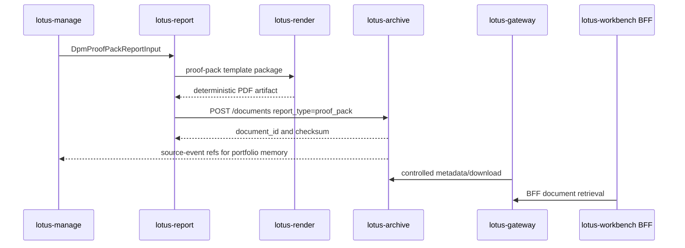
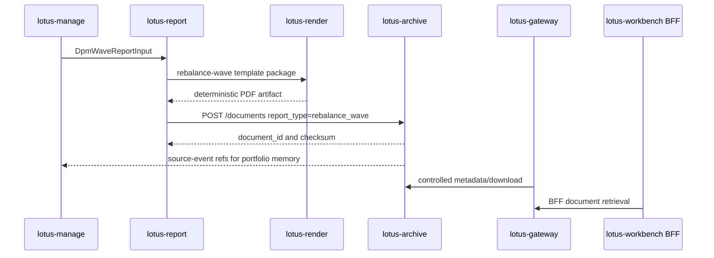
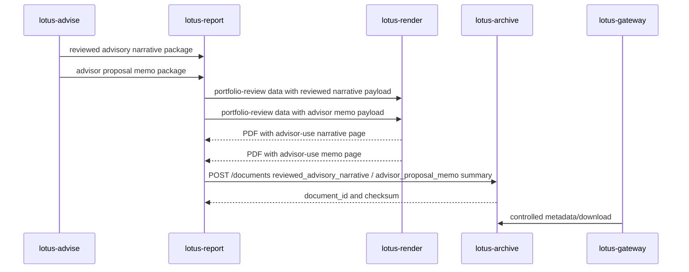

# lotus-archive Wiki

Lotus generated-document archive, retrieval, retention, legal hold, and access audit service

## Current posture

- Governed service boundary scaffold is in place.
- Runtime composition is explicit. The local profile uses in-memory metadata/audit repositories and
  filesystem object storage; production-like profiles must configure durable persistence/storage or
  fail closed instead of silently publishing non-durable archive state.
- Health, readiness, metadata, metrics, correlation/trace headers, safe error envelopes, structured
  route-template request logging, metadata model, migration contract, filesystem-backed
  local-development storage,
  checksum validation, idempotent archive-write domain behavior, internal archive create API,
  controlled metadata lookup, checksum-verified binary download, access-audit recording, retention
  posture lookup, purge eligibility and execution, and legal-hold set/release with purge blocking
  are available.
- Lifecycle relationship APIs for supersession, correction, reissue, and current-document
  resolution are available.
- `GET /documents/{document_id}/source-events` projects archive-owned generated-document and
  client-delivery reissue lineage for downstream portfolio-memory consumers without raw document
  bytes, storage keys, raw report payloads, or raw client references.
- Report-to-archive handoff after successful PDF render is available through `lotus-report`.
- RFC-0042 outcome-review report artifacts are governed by the same generated-document archive,
  retrieval, retention, legal-hold, access-audit, purge, and lifecycle posture when `lotus-report`
  supplies `report_type=outcome_review` metadata.
- RFC-0040 proof-pack report artifacts are governed by the same archive lifecycle when
  `lotus-report` supplies `report_type=proof_pack`, the `proof-pack` render template, and
  `dpm_proof_pack_report_input.v1` metadata.
- RFC-0041 rebalance-wave report artifacts are governed by the same archive lifecycle when
  `lotus-report` supplies `report_type=rebalance_wave`, the `rebalance-wave` render template, and
  `dpm_wave_report_input.v1` metadata.
- RFC-0023 advisor-review narrative portfolio-review artifacts can preserve a support-safe
  `reviewed_advisory_narrative` archive summary after `lotus-report` and `lotus-render` include the
  rendered advisor-use narrative page. The archive summary stores lineage and posture, not raw
  narrative sections, and does not promote client-ready commentary.
- Archive metadata accepts only governed generated-report types: `portfolio_review`,
  `outcome_review`, `proof_pack`, and `rebalance_wave`.
- `/metadata` publishes RFC-0108 `archive.observability.archive_supportability` posture covering
  retrieval, retention, legal hold, access audit, lifecycle, gateway retrieval, and Gateway-backed
  Workbench retrieval.
- `lotus_archive_supportability_total` is implementation-backed with bounded `state`, `reason`,
  and `freshness_bucket` labels only, with recorder-level fallback for unknown label values.
- Workbench retrieval is supported only through the Workbench BFF and `lotus-gateway`; Workbench
  must not call `lotus-archive` directly.
- This service is limited to Lotus-generated document archive scope. It is not a generic file store
  or manual upload service.
- Wiki source lives in-repo and must be published through lotus-platform automation.

## Proof-Pack Archive Flow

## Rebalance-Wave Archive Flow

## Reviewed Advisory Narrative Archive Flow

## Operator links

- `README.md`
- `docs/architecture/archive-service-boundaries.md`
- `docs/supported-features.md`
- `docs/runbooks/service-operations.md`
