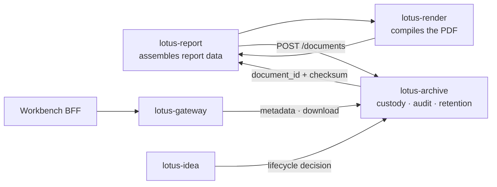

# lotus-archive

The system of record for documents the Lotus platform has generated. Once `lotus-report` has
produced a client document and `lotus-render` has compiled it, `lotus-archive` is what can still
answer, years later: *what was produced, for whom, from what evidence, who has looked at it, and may
it be destroyed yet.*

## Why it exists

A private bank does not merely send documents; it must be able to account for them. A regulator asks
which portfolio review a client received in Q3 and whether it was ever corrected. Legal asks for
every document touching a matter to be frozen. Data protection asks that a document be destroyed
once its retention period has run — and only then. Each of those questions is unanswerable if
generated documents are scattered across the services that happened to produce them.

`lotus-archive` exists so that those questions have one place to be asked, with four properties that
have to hold together:

- **Custody is provable.** Every document carries a SHA-256 checksum verified at write, the render
  and report identifiers it came from, and the snapshot it was built on. The document can be tied
  back to its evidence without trusting the service that produced it.
- **Access leaves a trace.** Metadata reads, binary downloads, purge evaluations, legal-hold changes
  and denied attempts all record an access event. Who looked is part of the record, not a log line.
- **Destruction is governed, not incidental.** A document is destroyed only when its retention has
  elapsed and no legal hold is active, and the decision is recorded whichever way it goes. Absence of
  a retention date means *never*, not *now*.
- **Correction is additive.** A document is never edited. Supersession, correction and reissue create
  new documents and append a relationship, so the history of what a client was told stays intact.

The service is deliberately narrow to make those properties defensible. It is **not** a general file
store, not a manual upload surface, not a delivery channel, and not a renderer.

## Current status — read this before planning a deployment

`lotus-archive` **cannot currently run in a production configuration.** This is a delivery gap, not
a configuration task:

- the settings validator rejects the in-memory repository and filesystem storage for any profile
  other than `local-development` or `test`
- the runtime composer rejects everything *except* the in-memory repository and filesystem storage,
  because the PostgreSQL and S3 adapters are not implemented

The two are mutually exclusive, so no value of `LOTUS_ARCHIVE_RUNTIME_PROFILE=production` produces a
running service. Two consequences follow in the one runnable configuration: **archived bytes sit on
a local filesystem path** (defaulting to the OS temp directory) and **access audit records are
in-memory and do not survive a restart**. Tracked as
[#90](https://github.com/sgajbi/lotus-archive/issues/90); see
[Configuration](./Configuration.md#what-can-actually-run) for the detail.

Everything below describes behaviour that is implemented and exercised by tests. It runs. It is not
yet deployable.

## Who uses it

| Reader | What matters | Start here |
|---|---|---|
| Business, risk and compliance | what is retained, what blocks destruction, what a correction does to the record | [Document Lifecycle](./Document-Lifecycle.md) |
| Integration engineers | the 22 operations, the archive contract, who may call what | [API Surface](./API-Surface.md) |
| Security and audit | how a caller is identified, what is scoped, what is recorded | [Security and Controls](./Security-and-Controls.md) |
| Operations | readiness, posture, incident checks | [Operations](./Operations.md) |
| Engineers on the repo | structure, gates, what CI runs | [Architecture](./Architecture.md), [Development and Testing](./Development-and-Testing.md) |

Callers are services, never people directly. `lotus-report` writes; `lotus-gateway` reads on behalf
of the product; `lotus-idea` reads a narrow lifecycle projection. **Workbench must never call
`lotus-archive` directly** — retrieval goes through the Workbench BFF and `lotus-gateway`.

## What it accepts

Only Lotus-generated report documents, of four governed types:

| `report_type` | produced from | template |
|---|---|---|
| `portfolio_review` | client portfolio review | `portfolio-review` |
| `outcome_review` | post-trade outcome review | `outcome-review` |
| `proof_pack` | pre-trade proof pack, including reviewed Idea evidence | `proof-pack` |
| `rebalance_wave` | rebalance wave evidence | `rebalance-wave` |

Anything else is rejected at validation. Three optional support-safe summaries may accompany a
document — reviewed advisory narrative, advisor proposal memo, and Idea evidence pack — each pinned
by validation to the report type and template it belongs with, and each storing lineage and posture
rather than the underlying content. See [API Surface](./API-Surface.md#the-archive-contract).

## What it does not own

- **the document's content** — `lotus-report` assembles it, `lotus-render` compiles it
- **retention policy** — the retaining period arrives on the document; archive enforces it, and does
  not compute it
- **delivery to clients** — archive records that a document exists, not that anyone received it
- **client-publication authority** — an Idea evidence pack is archived with that authority withheld
  and archiving does not grant it
- **disposal authority for downstream consumers** — the Idea lifecycle decision endpoint projects
  archive posture; it never authorises destruction

## Where a document comes from

```mermaid
flowchart LR
  RPT["lotus-report<br/>assembles report data"] --> RND["lotus-render<br/>compiles the PDF"]
  RND --> RPT
  RPT -- "POST /documents" --> ARC["lotus-archive<br/>custody · audit · retention"]
  ARC -- "document_id + checksum" --> RPT
  GW["lotus-gateway"] -- "metadata · download" --> ARC
  WB["Workbench BFF"] --> GW
  IDEA["lotus-idea"] -- "lifecycle decision" --> ARC
```

The sequence matters: a document reaches the archive only after it has been rendered, so what is
archived is the artefact a client could receive — not a description of one. Per-report-type flows are
in [Document Lifecycle](./Document-Lifecycle.md#how-each-report-type-arrives).

## Known gaps

Recorded so that absence is not mistaken for capability.

| gap | consequence | tracked |
|---|---|---|
| no durable adapters | no production profile can start; bytes are local, audit is in-memory | [#90](https://github.com/sgajbi/lotus-archive/issues/90) |
| supportability is declared, not measured | `/metadata` reports `ready` and `accessAuditSupported: true` regardless of whether anything works | [#91](https://github.com/sgajbi/lotus-archive/issues/91) |
| migration gate never runs in CI | the schema contract is checked only if a developer runs `make check` locally | [#92](https://github.com/sgajbi/lotus-archive/issues/92) |
| `tenant_id` optional on write, required on read | a document archived without one is stored and then permanently unreadable | [#93](https://github.com/sgajbi/lotus-archive/issues/93) |
| Idea lifecycle decisions not certified | managed keys, durable persistence, consumer trust distribution and legal approval remain open | [#55](https://github.com/sgajbi/lotus-archive/issues/55) |

## The pages

1. [Architecture](./Architecture.md) — module families, runtime composition, what is in memory
2. [API Surface](./API-Surface.md) — all 22 operations and the archive contract
3. [Document Lifecycle](./Document-Lifecycle.md) — retention, legal hold, purge, supersession
4. [Security and Controls](./Security-and-Controls.md) — caller identity, scope, audit, checksums
5. [Configuration](./Configuration.md) — every setting, and what can actually run
6. [Operations](./Operations.md) — readiness, posture, metrics, incident checks
7. [Development and Testing](./Development-and-Testing.md) — building, testing, gates
8. [Glossary](./Glossary.md) — the vocabulary and where each term is defined
